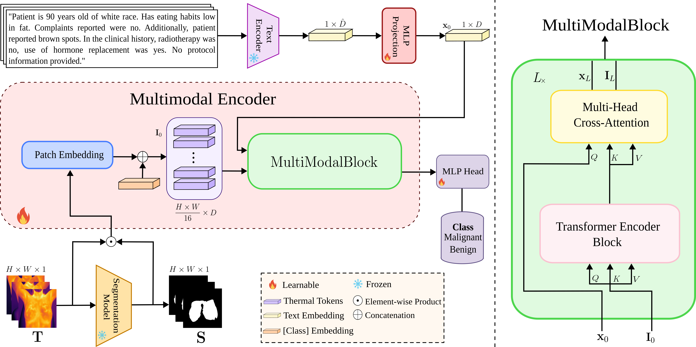

<div align="center">
  
# Multimodal Vision-Language Transformer for Thermography Breast Cancer Classification

<a href="#">
  
</a>

[Guillermo Pinto](https://guillepinto.github.io/), [Julián León](https://www.linkedin.com/in/nobodys-stache/), [Brayan Quintero](https://github.com/BrayanQuintero123), [Dana Villamizar](https://github.com/DanaVillamizar) and [Hoover Rueda-Chacón](hfarueda.com)

Research Group: [Hands-on Computer Vision](https://semillerocv.github.io/)

### [Paper](assets/docs/paper.pdf) | [Checkpoints](https://huggingface.co/SemilleroCV)

> **Abstract:** We propose a multimodal vision-language transformer designed to classify breast cancer from a single thermal image, irrespective of viewing angle, by integrating thermal features with structured clinical metadata. Our framework generates descriptive text prompts from patient-specific variables, which are embedded and jointly fused with image tokens via crossattention blocks. Extensive experiments on the DMR-IR and Breast Thermography datasets demonstrate that our method achieves 97.5% accuracy on DMR-IR and 83.7% on Breast Thermography, surpassing state-of-the-art multimodal and visual-only baselines in sensitivity. By combining clinical cues, our approach offers a flexible, robust, and interpretable solution for early breast cancer detection with potential for clinical translation in diverse healthcare scenarios.

</div>

</br>

<p align="center">  </p>

**Overview:** BreastCATT introduces a multimodal vision-language transformer that combines thermal imaging analysis with structured clinical metadata. Our approach generates descriptive text prompts from patient-specific variables (age, symptoms, medical history), which are embedded and fused with image tokens via cross-attention mechanisms. This integration enables robust breast cancer classification from single thermal images, regardless of viewing angle, offering a flexible solution for diverse clinical scenarios.

## Key Features

- 🔥 **Vision-Language Integration**: Combines thermal imaging with structured clinical metadata through descriptive text prompts
- 🎯 **Cross-Attention Fusion**: Advanced fusion of image tokens and text embeddings via cross-attention blocks
- 📐 **Viewing Angle Agnostic**: Robust classification performance irrespective of thermal image viewing angle
- 🩺 **Clinical Metadata Integration**: Leverages patient-specific variables (age, symptoms, medical history) for enhanced accuracy
- 📊 **Multi-Dataset Validation**: Demonstrated performance on DMR-IR and Breast Thermography datasets
- 🔄 **Transfer Learning**: Built on pre-trained vision transformers with domain adaptation
- 📈 **Superior Sensitivity**: Outperforms state-of-the-art visual-only and multimodal baselines

## Dataset

Our experiments utilize two thermal imaging datasets for comprehensive evaluation:

### DMR-IR Dataset
The DMR-IR (Database for Research Mastology with Infrared Image) dataset contains thermal images for breast cancer detection. 

This dataset includes structured clinical metadata (patient age, symptoms, medical history) which is converted into descriptive text prompts for multimodal fusion.

### Breast Thermography Dataset
Additional validation dataset containing thermal breast images with diverse viewing angles and patient demographics, enabling robust evaluation of model generalization capabilities.


## Architecture

BreastCATT implements a sophisticated multimodal vision transformer with the following components:

- **Vision Encoder**: Custom ViT implementation with configurable depths and attention heads
- **Language Model**: GatorTron-based text processing for multimodal fusion
- **Cross-Attention**: Facilitates interaction between visual and textual features
- **Segmentation Module**: Optional segmentation head for spatial analysis
- **Fusion Layer**: Alpha-weighted combination of modalities

## Installation

### Prerequisites

- Python 3.10+
- CUDA-compatible GPU (recommended)
- conda or pip package manager

### Setup

1. Clone the repository:
```bash
git clone https://github.com/semilleroCV/BreastCATT.git
cd BreastCATT
```

2. Create and activate a conda environment:
```bash
conda create -n breastcatt python=3.10
conda activate breastcatt
```

3. Install dependencies:
```bash
pip install -r requirements.txt
```

4. Download pre-trained checkpoints:
```bash
# MAE pre-trained weights will be downloaded automatically
# Or manually download from: checkpoints/fvit/
```

## Usage

### Training from Scratch

Train a custom BreastCATT model:

```bash
python train.py \
    --dataset_name "SemilleroCV/DMR-IR" \
    --vit_version "base" \
    --use_cross_attn True \
    --use_segmentation False \
    --num_train_epochs 10 \
    --learning_rate 5e-5 \
    --per_device_train_batch_size 8
```

### Fine-tuning Pre-trained Models

Fine-tune from HuggingFace Hub models:

```bash
python train.py \
    --vit_version "best" \
    --model_name_or_path "SemilleroCV/breastcatt-base" \
    --dataset_name "SemilleroCV/DMR-IR" \
    --num_train_epochs 5 \
    --learning_rate 2e-5
```

### Using Finetune Script

For standard transformer fine-tuning:

```bash
python finetune.py \
    --model_name_or_path "google/vit-base-patch16-224-in21k" \
    --dataset_name "SemilleroCV/DMR-IR" \
    --num_train_epochs 10 \
    --learning_rate 3e-5
```

### Model Variants

Choose from different model sizes:

| Model | Parameters | Embedding Dim | Attention Heads | Layers |
|-------|------------|---------------|-----------------|---------|
| Small | ~22M | 384 | 6 | 12 |
| Base | ~86M | 768 | 12 | 12 |
| Large | ~307M | 1024 | 16 | 24 |
| Huge | ~632M | 1280 | 16 | 32 |

### Configuration Options

Key parameters for customization:

- `--use_cross_attn`: Enable cross-attention between modalities
- `--use_segmentation`: Include segmentation head
- `--alpha`: Fusion weight for multimodal combination
- `--vit_version`: Model size (small/base/large/huge/best)
- `--checkpointing_steps`: Save frequency for model checkpoints

## Evaluation

### Metrics

We evaluate models using comprehensive metrics:

- **Accuracy**: Overall classification accuracy
- **Precision**: Positive predictive value
- **Recall (Sensitivity)**: True positive rate
- **Specificity**: True negative rate

### Cross-Validation

Implement robust evaluation with k-fold cross-validation:

```bash
# Run 7-fold cross-validation
python scripts/run_kfold_validation.py \
    --n_splits 7 \
    --model_config "config/breastcatt_base.json"
```

## Results

Our experiments demonstrate state-of-the-art performance on thermal breast cancer detection across two datasets:

### DMR-IR Dataset Results

Comparison with multimodal fusion methods on DMR-IR dataset:

| Method | Accuracy | Precision | Sensitivity | Specificity |
|--------|----------|-----------|-------------|-------------|
| Sánchez-Cauce et al. | 0.940 | **1.000** | 0.670 | **1.000** |
| Mammoottil et al. | 0.938 | 0.941 | 0.889 | 0.967 |
| Tsietso et al. | 0.904 | 0.933 | 0.933 | 0.833 |
| **Ours** | **0.975** | 0.963 | **0.966** | 0.979 |

### Breast Thermography Dataset Results

Classification results on Breast Thermography dataset:

| Model | Accuracy | Precision | Sensitivity | Specificity |
|-------|----------|-----------|-------------|-------------|
| ViT-Base | 0.884 | 0.833 | 0.556 | 0.971 |
| MobileNetV2 | 0.837 | 0.750 | 0.333 | 0.971 |
| Swin-Base | **0.907** | **0.857** | 0.667 | 0.971 |
| Ours (from scratch) | 0.837 | 0.000 | 0.000 | **1.000** |
| **Ours (pretrain & fine-tune)** | 0.837 | 0.769 | **0.714** | 0.897 |

### Key Findings

- **State-of-the-art Performance**: Achieved 97.5% accuracy on DMR-IR dataset, surpassing previous multimodal methods
- **Superior Sensitivity**: Best sensitivity (96.6%) on DMR-IR among all compared methods
- **Multimodal Advantage**: Integration of clinical metadata with thermal imaging significantly improves performance
- **Transfer Learning Benefits**: Pre-training and fine-tuning approach shows improved sensitivity on Breast Thermography dataset
- **Robustness**: Consistent performance across different datasets and patient demographics

## Checkpoints

Pre-trained models are available on HuggingFace Hub:

- [BreastCATT-Base](https://huggingface.co/SemilleroCV/breastcatt-base)
- [BreastCATT-Large](https://huggingface.co/SemilleroCV/breastcatt-large)
- [Fine-tuned ViT](https://huggingface.co/SemilleroCV/vit-base-thermal-breast)

## Notebooks

Explore our analysis and experiments:

- [`modeling.ipynb`](notebooks/modeling.ipynb): Model architecture exploration
- [`trainer.ipynb`](notebooks/trainer.ipynb): Training pipeline demonstration
- [`segmentation.ipynb`](notebooks/segmentation.ipynb): Segmentation analysis
- [`multi-prompt-probe.ipynb`](notebooks/prompt-linear-probing.ipynb): Prompt linear probing

## Citation

If you find our work useful in your research, please cite:

```bibtex
@article{pinto2025multimodal,
  title={Multimodal Vision-Language Transformer for Thermography Breast Cancer Classification},
  author={Pinto, Guillermo and León, Julián and Quintero, Brayan and Villamizar, Dana and Rueda-Chacón, Hoover},
  journal={xxxxx},
  year={2025}
}
```

## Acknowledgements

We thank the researchers who provided the DMR-IR dataset and the HuggingFace team for their transformers library. Special recognition to the MAE authors for pre-trained vision transformer weights.

## License

This project is licensed under the MIT License - see the [LICENSE](LICENSE) file for details.

## Contact

For questions and collaborations:
- **Guillermo Pinto**: guillermo2210069@correo.uis.edu.co
- **Research Group**: [Hands-on Computer Vision](https://github.com/semilleroCV)
